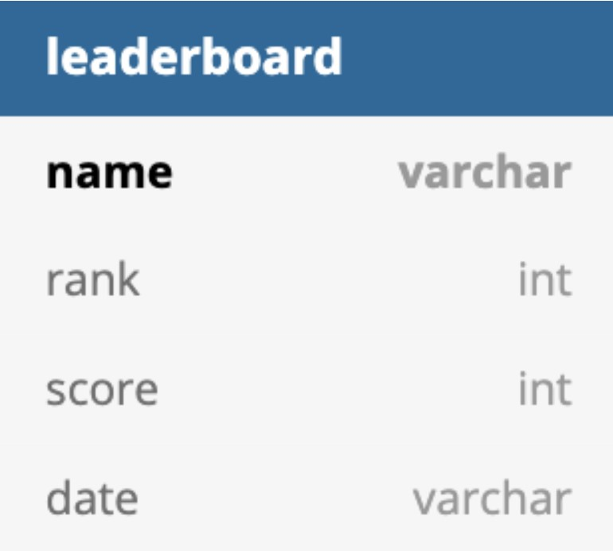

# Blappy Fird

---

San Jose State University 
Course: Enterprise Software - CMPE 172 / Spring 2020 
By Brian Tao, Haasitha Pidaparthi, Syed Sarwar 

## Project Introduction

---

This is a three-tier web application inspired by the very popular Flappy Bird mobile app that rose to fame in 2014. This game is very simple in premise: the player controls a bird that travels in short hops, attempting to navigate between and around clouds without touching them as the game stage continuously scrolls sideways. The character hops each time the player presses the up arrow key and naturally falls downwards, mimicking gravity. If the character makes contact with any obstacle or the top or bottom of the screen, the game ends. The score increases with time, with the goal being to survive as long as possible to accumulate a high score. The player is also able to choose between three different character designs.

## Sample Demo Screenshots

---

> The pause screen.

> Game is running with the pink bird.

> Game ended, now displaying the score for the current run and the high score.

## Prerequisites

---

Main Project:
- JDK 1.8
- Spring Boot
- Gradle 4+ or Maven 3.2+
- MySQL database

JavaScript Leaderboard:
- Node.js
- MySQL database
- Node.js "mysql" module

To access a MySQL database with Node.js, you need a MySQL driver, such as the "mysql" module, downloaded from NPM.

To download and install the "mysql" module, open the Command Terminal and execute the command `>npm install mysql`

## Running The Project Locally

---

1. Download the project files.
2. Open a command prompt and navigate to the directory containing the project.
3. Type in `spring boot run` to open the app.
4. Enter in your name. This will be used to record your score for the leaderboard after the game ends.
5. Once the game has ended, open a web browser and go to localhost:8080/play to see the top ten high scores.

## Diagrams

---

### Class Diagram

### Sequence Diagram

## Schema

---

## Database Queries

---

## Mid-tier APIs

---

The application will be hosted on the local server running on port 8080. Using spring boot the application is able to handle its data relay onto an API by pushing the high score of the flappy bird game as well as the current score along with a name. People who update their score will then have it prompted to open up onto a leaderboard which contains all the top scores. Using maven for configurations and then the spring boot layer to handle all the api returns. There is a service component which is handled by the GameRunner class which runs the game and holds the score and high score along with a constructor and getters and setters which are relayed to the class blappy_firdController to handle what will be pushed to the rest api. Using the mapping /play/scoreboard gives you the scoreboard to be handled alongside the app.

## UI Data Transport

---

### Game

> The game is run in the GameRunner class. This class calls the actionPerformed() method, shown above, every 15 ms. In turn, actionPerformed() calls the repaint() method on the GameBoard gb. Inside the GameBoard, this calls the paintComponent() method.

> The GameBoard holds and draws all the visual elements of the game. The frequent calling of the repaint() method updates all visual changes to the GameBoard to produce the animation effect.

### JS Leaderboard

> This is a leaderboard of the Blappy Fird high scores, written using Node.js.
>
> High-level code explanation:
> 1. Create a connection to the MySQL database using the 'mysql' module provided by Node.js
> 2. Read the leaderboard scores from the database
> 3. Create a HTTP server using the 'http' module provided by Node.js
> 4. Create a HTTP table for the leaderboard and use the scores from the database to populate the table
